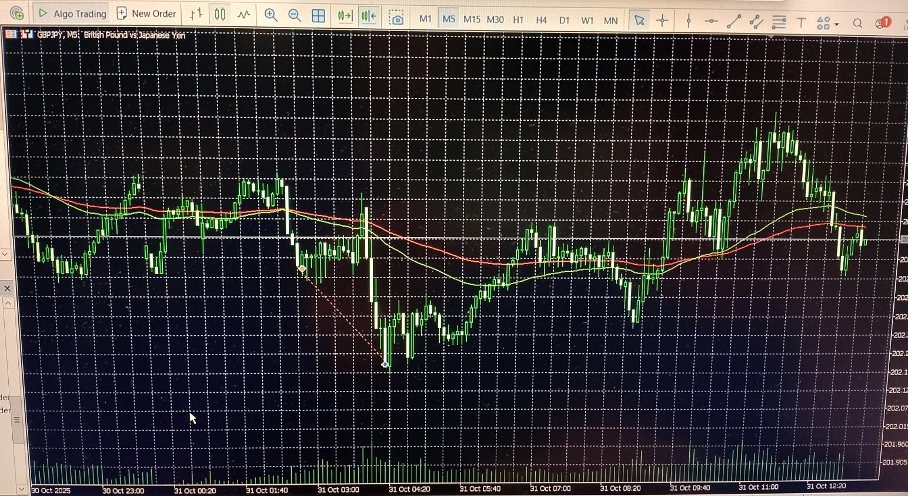

# Forex Module – GBPJPY Sell Example

**Image captured:** 2025‑10‑31  
**Symbol:** GBPJPY  
**Context:** Live execution example from the forex module (no trend module active)  
**Description:** Single‑position logic with fixed 1:1 reward during the Asian session open, targeting a statistically validated reversal zone.

_The EA executed a predefined entry and take‑profit level derived from multi‑year weekday statistics.  
Price reached the TP with near‑perfect precision before reversing sharply — all based on structure and statistical edge._

---

## 🧠 What Happened in This Specific Trade

At the scheduled session timestamp, the EA opened **a single sell position**:

- The entry was based on a predefined session range and timing.  
- The TP was set at a fixed 1:1 reward level, calibrated from historical weekday data.  
- Price moved cleanly into the TP zone and reversed shortly after.

This trade demonstrates how the forex module can capture short‑term directional moves using **pure statistical logic**, without trend continuation or discretionary input.

---

## 🎯 Reward Logic in This Trade

- **Reward model**: Fixed 1:1 (Forex module)
- **Session**: Asian session open 
- **Weekday**: Friday 
- **Volatility context**: Historically low volatility, making reversal‑based setups highly reliable

The EA used a deterministic reward structure — no trailing, no trend logic — and exited at the statistically most probable turning point.

---

## 🔍 Why This TP Is Significant

This trade illustrates:

- how clean execution can occur without trend logic  
- how fixed reward levels can still align with market structure  
- how statistical calibration can produce precision even in short‑term setups  
- how reversals can be anticipated without indicators or discretionary filters

The TP was hit just before sentiment shifted — a pattern confirmed repeatedly in historical data.

---

## 📌 Summary of This Trade

This GBPJPY sell trade demonstrates the forex module’s core behavior:

- **Single‑position execution**  
- **Fixed 1:1 reward targeting**  
- **No trend module active**  
- **TP hit at statistically validated reversal zone**  
- **No discretionary input — fully automated logic**  

This example shows how the system captures short‑term impulses with precision using nothing but structure, statistics, and deterministic logic.
