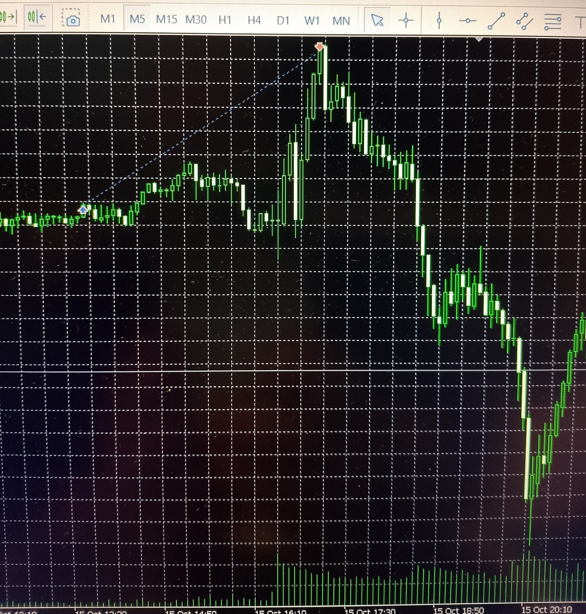

# Index Module Execution — US30 (2025‑10‑15)

## 🕒 Context

- **Symbol**: US30  
- **Date**: 2025‑10‑15  
- **Session**: Wednesday open market
- **Context**: Live execution example from the index module
- **Description**: Premarket‑based pending order with weekday‑specific open market reward level

_The EA executed a predefined entry and take‑profit level derived from multi‑year weekday statistics.
Price reached the TP with near‑perfect precision before reversing immediately._

---

## 🎯 Outcome

- **TP hit**: Yes  
- **TP precision**: Exact spike top before reversal  
- **Market reaction**: Sharp reversal immediately after TP  

This trade is a textbook example of how weekday‑specific reward levels can align with historical turning points.  
The open market reward (2:1) was selected based on multi‑year data for Wednesdays on US30 — and matched the spike top with near‑perfect precision.

---

## 📊 Commentary

This execution illustrates:

- how deterministic logic can produce precise outcomes  
- how statistical reward levels outperform fixed targets  
- how edge can be captured without discretionary input  

The EA followed its logic exactly:  
placed the order, calculated the reward, and exited at the statistically most probable point — before the market reversed.

---

## 🔍 Notes

- No manual intervention — fully automated execution  
- Trend Module was disabled for this weekday based on historical continuation patterns.

