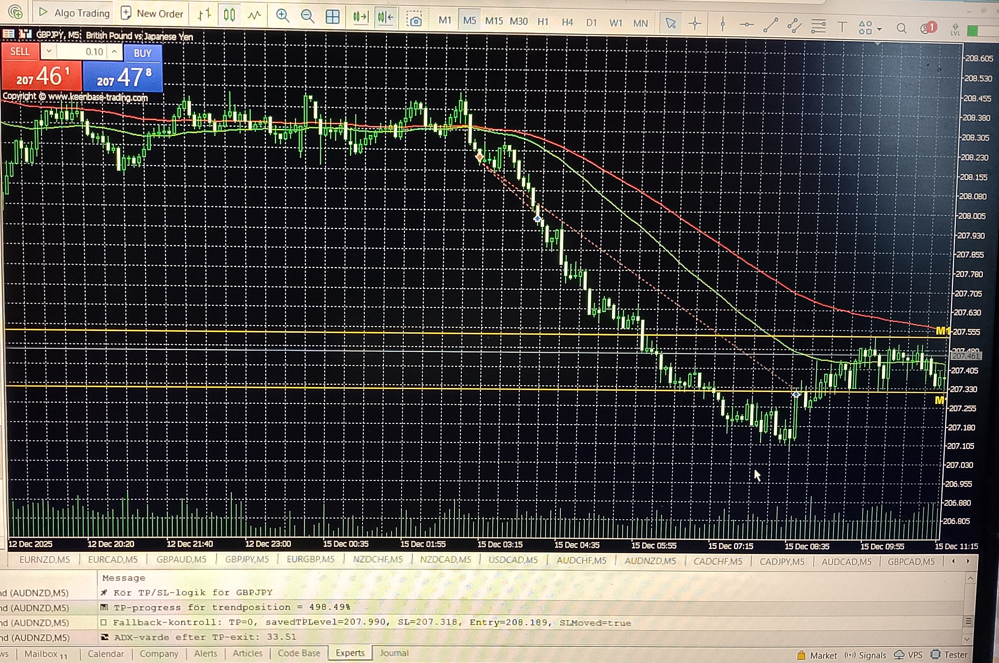

# Trend Module – GBPJPY Example

**Image captured:** 2025‑12‑15  
**Symbol:** GBPJPY  
**Context:** Live execution example from the trend module  
**Description:** Two‑position logic with TP‑leg and trend‑leg behavior



_The first position captures the initial impulse (TP‑leg), while the second position remains active until a structural reversal triggers the stop loss._

---

## 🧠 What Happened in This Specific Trade 

At the scheduled session timestamp, the EA opened **two sell positions**: 

- The **TP‑leg** quickly reached its take‑profit level as price moved cleanly in the expected direction. 
- The **trend‑leg** remained open and was managed by the trend module’s structural trailing logic. 

This trade is a textbook example of how the system captures both the **initial impulse** and the **extended trend continuation**. 

--- 

## 🔄 5‑Minute Structural Update Cycle and Stop‑Loss Adjustment 

The trend‑leg is evaluated on a **fixed structural interval**, aligned with the system’s five‑minute update cycle. During each evaluation, the module determines whether the prevailing trend justifies advancing the protective stop or holding it in place. 

In this trade: 

- Strong continuation signals resulted in **multiple downward SL adjustments** (sell trade). 
- Periods of weakening momentum caused the SL to **remain unchanged**, preserving structural integrity. 

This controlled, non‑reactive trailing behavior ensures: 

- profit protection 
- trend‑following behavior 
- no premature exits due to noise 
- deterministic, rule‑based execution

## ⚙️ Fallback Control in Action 

The fallback system ensures that: 

- TP levels are stored safely 
- SL adjustments are validated 
- no trailing step is applied unless conditions are met 
- the system remains deterministic even during volatility 

In this trade, fallback control confirmed: 

- the saved TP level 
- the correct SL movement 
- that the SL update was valid (`SLMoved=true`) 

--- 

## 📋 Log Extract (translated)

```text
TP/SL logic for GBPJPY
TP progress for trend position
Fallback control: savedTPLevel=207.990, SL=207.318, Entry=208.189, SLMoved=true
ADX value after TP exit: 33.51
```

---

**What this tells us about the trade:**

- TP‑leg closed cleanly  
- Trend‑leg was actively managed  
- SL was moved downward as structure evolved  
- ADX confirmed strong trend conditions at the time of TP exit  
- The final exit occurred only when structure broke

---

## 📌 Summary of This Trade

This GBPJPY sell trade demonstrates the trend module’s live behavior:

- **TP‑leg** captures the initial directional impulse  
- **Trend‑leg** follows the move using structural trailing  
- **SL is evaluated every 5 minutes**  
- **ATR‑based trailing** adjusts SL downward only when justified  
- **ADX provides context**, not exit signals  
- **Exit occurs on structural break**, not indicator noise  

This example shows exactly how the trend module behaves in real market conditions:  
**disciplined, deterministic, and structurally driven.**
