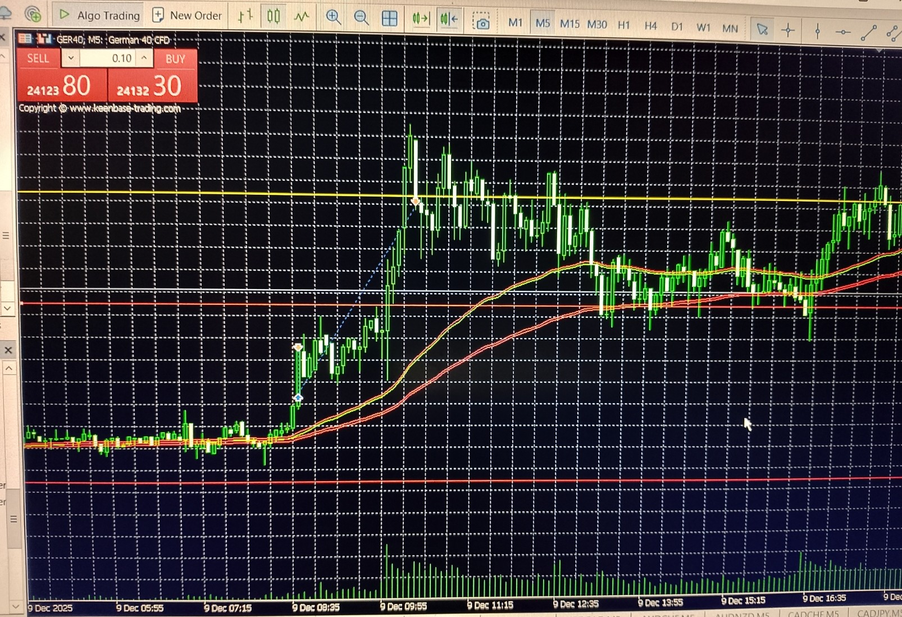

# Trend Module – GER40 Example

**Image captured:** 2025‑12‑09  
**Symbol:** GER40  
**Context:** Live execution example from the index module with trend module enabled  
**Description:** Two‑position logic with TP‑leg and trend‑leg behavior on open market breakout



_The EA executed a predefined entry and take‑profit level derived from multi‑year weekday statistics.  
Price reached the TP during the first open market impulse. The trend‑leg was stopped out after another two hours via trailing logic — just before sentiment reversed._

---

## 🧠 What Happened in This Specific Trade

At the scheduled session timestamp, the EA opened **two buy positions**:

- The **TP‑leg** reached its take‑profit level cleanly as price accelerated upward.  
- The **trend‑leg** remained open and was managed by the trend module’s structural trailing logic.  
- After several trailing adjustments, the SL was triggered — exiting the trade before the market reversed.

This trade shows how the system captures both the **initial impulse** and manages the **trend continuation** with disciplined stop logic.

---

## 🔄 5‑Minute Structural Update Cycle and Stop‑Loss Adjustment

The trend‑leg was evaluated on the system’s **fixed five‑minute update cycle**.  
During each evaluation, the module determined whether the prevailing structure justified advancing the protective stop.

In this trade:

- Momentum remained strong for several intervals, resulting in **multiple upward SL adjustments** (buy trade).  
- As momentum faded, the SL was **held steady**, preserving structure.  
- Eventually, the SL was triggered — exiting the trade before sentiment turned.

This controlled, non‑reactive trailing behavior ensures:

- profit protection  
- trend‑following logic  
- no premature exits due to noise  
- deterministic, rule‑based execution

---

## ⚙️ Fallback Control in Action

The fallback system ensures that:

- TP levels are stored safely  
- SL adjustments are validated  
- no trailing step is applied unless conditions are met  
- the system remains deterministic even during volatility

In this trade, fallback control confirmed:

- the saved TP level  
- the correct SL movement  
- that the SL update was valid (`SLMoved=true`)  
- that the exit occurred before sentiment reversal

---

## 📋 Log Extract (translated)

```text
TP/SL logic for GER40
TP progress for trend position = 352,57%
Fallback control: savedTPLevel=24096.8, SL=24164.3, Entry=24075.50, SLMoved=true
ADX value after TP exit: 29.44
´´´
*Note: TP progress reflects the distance from the TP‑leg’s predefined TP level — this is how the trend module quantifies extended structural continuation.*
