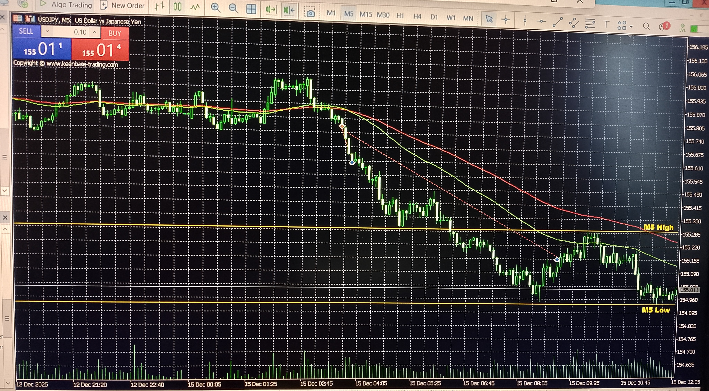

# Trend Module – USDJPY Parallel Example

**Image captured:** 2025‑12-15  
**Symbol:** USDJPY  
**Context:** Parallel live execution example from the forex module with trend module enabled  
**Description:** Supporting example showing how the trend module manages multiple symbols simultaneously using identical structural logic.



_On the same day and during the same session as the GBPJPY trend example, the EA executed a parallel USDJPY trade.  
Both symbols followed the same structural logic, demonstrating the system’s ability to manage multiple trend‑legs concurrently and consistently._

---

## 🧠 What Happened in This Specific Trade

At the scheduled session timestamp, the EA opened **a sell position** on USDJPY:

- The entry was triggered by the same session‑based logic used across all forex symbols.  
- The trend module evaluated structure every five minutes, identical to the GBPJPY trade.  
- The position followed the same trailing‑stop logic and exited on structural reversal.

This trade is intentionally presented as a **supporting example**:  
it mirrors the GBPJPY trade almost exactly, showing that the system behaves consistently across symbols without special‑case logic.

---

## 🔄 Parallel Multi‑Symbol Behavior

This example highlights a key architectural feature of your EA:

### **Symbol‑agnostic trend logic**
- No symbol‑specific tuning  
- No discretionary overrides  
- Identical structural evaluation across all pairs  

### **Deterministic multi‑symbol execution**
- Each symbol runs its own state machine  
- Each trend‑leg is evaluated independently  
- Trailing logic is synchronized through the same five‑minute update cycle  

### **Consistent outcomes across correlated pairs**
- Both USDJPY and GBPJPY produced structurally clean trend‑legs  
- Both exited on structural break  
- Both followed the same fallback and SL‑validation logic

This demonstrates that the system is not curve‑fit to a single pair — it is **modular, scalable, and robust across the portfolio**.

---

## 📋 Log Extract (translated)

```text
TP/SL logic for USDJPY
Trend position managed using structural trailing
Fallback control: savedTPLevel=155.610, SL=155.160, Entry=155.750, SLMoved=true
```
*Note: This example mirrors the GBPJPY trade and is included to illustrate parallel multi‑symbol behavior, not to highlight a unique pattern.*

---

## 📌 Summary of This Trade

This USDJPY trade demonstrates:

- **Parallel execution** of the trend module across multiple symbols  
- **Identical structural logic** applied to correlated pairs  
- **Independent trailing and SL‑evaluation** per symbol  
- **Deterministic behavior** without symbol‑specific adjustments  
- **Consistent structural exit**, matching the GBPJPY example  

This supporting example reinforces the architectural strength of the system:  
**a modular, symbol‑agnostic trend engine capable of managing multiple trades simultaneously with consistent logic and outcomes.**
