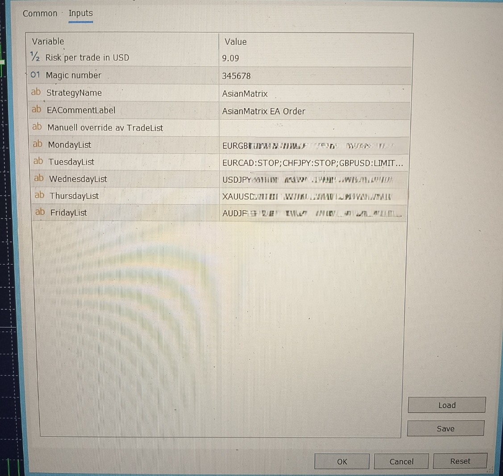
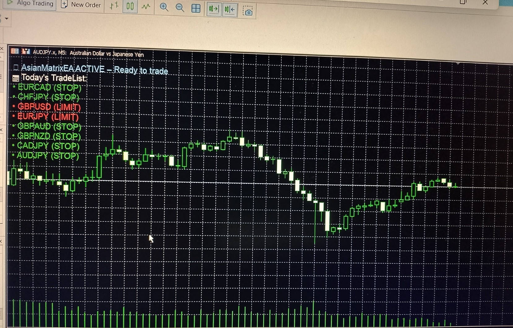

# Operational Interface — Inputs & Dashboard

This document describes the operational interface used to control the **Session Module** and its **multi‑symbol execution**.  
All configuration is handled through input fields, and the dashboard provides a visual overview of the active daily setup.

The operational interface is designed to ensure:

- **deterministic behaviour**
- **minimal daily configuration**
- **scalable multi‑symbol operation**
- **clear visibility** into the upcoming session

---

## **Input‑Driven Configuration**

The EA is fully controlled through a small set of input fields.  
This design allows the system to run dozens of symbols without modifying code or navigating complex settings.

### **Core Inputs**

#### **Risk per trade in USD**
A fixed USD‑based risk model used for deterministic lot‑size calculation.

#### **Daily TradeLists (Mon–Fri)**
Each weekday has its own configuration string defining:

- which symbols to trade  
- whether each symbol uses **STOP** or **LIMIT** behaviour  

#### **Manual Override**
Allows the user to override the current weekday and load a different TradeList.

#### **Strategy Metadata**
Includes:

- strategy name  
- magic number  

Used for clean terminal management and log separation.

---

## TradeList Format

Each TradeList uses a simple, deterministic structure:

```text
SYMBOL:ORDERTYPE;
```

This structure allows the system to:

- run any number of symbols
- mix STOP and LIMIT behaviour
- maintain identical logic across all symbols
- scale from 1 to 20+ symbols without code changes

---

## Dynamic Daily TradeList

The Daily TradeList is not static.
Symbols are added or removed based on multi‑year statistical performance per weekday.

This means:

- some symbols appear frequently
- some appear only on specific weekdays
- some drop off when their edge decays
- new symbols can be introduced when their behaviour becomes favourable

The list is therefore a living component of the system — shaped by empirical data rather than subjective judgement.

---

## Input Field Overview

Below is an example of the input configuration interface used to control the EA.
Note: Only one full example daily list is shown. Other weekday lists are omitted for proprietary reasons.



This interface provides:

- a clear overview of all operational parameters
- weekday‑specific symbol lists
- a single place to manage risk and execution behaviour
- a deterministic workflow for daily operation

---

## Dashboard‑Driven Multi‑Symbol Control

To improve usability, the system includes a lightweight dashboard that visualizes the active configuration.

The dashboard displays:

- **today’s TradeList**
- **each symbol** and its assigned **order type**
- **EA status** (active/inactive)
- a clean overview of the **upcoming session’s execution plan**

This allows the user to verify the entire setup **at a glance** before the session begins.



---

## EA Status Indicator

The dashboard includes a clear status indicator showing whether the EA is ready for execution.

#### 🟢 **ACTIVE — Ready to trade**
Displayed when all operational requirements are met:

- valid TradeList for the current weekday  
- supported symbol  
- trading permissions available  
- EA logic fully initialized  

#### 🔴 **INACTIVE — Action required**
Displayed when the EA cannot execute trades due to:

- missing or invalid TradeList  
- unsupported or unavailable symbol  
- missing trading permissions  
- terminal restrictions or initialization issues  

This immediate visual feedback ensures that configuration issues are detected **before** the session begins, preventing silent failures and ensuring deterministic behaviour.

---

## Design Goals

- Deterministic execution  
- Identical behaviour across all symbols and all days.
- Minimal configuration  
- All control handled through a small set of input fields.
- Scalable multi‑symbol operation  
- No upper limit on the number of symbols.
- Clear operational workflow  
- Dashboard provides instant visibility into the session.

### Separation of concerns:  

Inputs and dashboard handle operation, while the Session Module handles logic.

---

## Relationship to the Session Module

The operational interface feeds directly into the Session Module:

- Inputs define which symbols are active.
- The Session Module computes premarket ranges for each symbol.
- Pending orders are placed at the session timestamp.
- Dashboard provides visibility into the entire process.

This separation ensures a clean architecture where:

- logic remains deterministic
- configuration remains simple
- operation remains transparent